<!-- Technology Tags -->

<div align="center">
  <div>
    
    
    
    
    
  </div>
  <h2 align="center"> ♟️Multiplayer Chess Game</h2>

   <div align="center">
     An interactive, real-time multiplayer chess game built with the MERN stack and Socket.io. Play classic chess with your friends, track game state in real-time, and enjoy a responsive UI.
    </div>
</div>


## 📚 Table of Contents

- [📖 Introduction](#introduction)  
- [🛠 Tech Stack](#tech-stack)  
- [✨ Features](#features)  
- [📸 Demonstration](#demonstration)  
- [🚀 Project Start Guide](#project-start-guide)  
- [🪛 Future Enhancements](#Future-Enhancements)
- [👨‍💻 Author](#author)  
- [🔗 Socials](#socials)

---

<a id="introduction"></a>
## 📖 Introduction

This MERN Chess Game allows two players to connect and play a full game of chess in real-time using Socket.io. The goal is to demonstrate both real-time bi-directional communication using Socket.io and complex game logic like chess move validation, check/checkmate detection, and multiplayer syncing.


PlayChess is a modern, real-time multiplayer chess game built with React, Node.js, and Socket.io. It allows players to compete in online chess matches, track their game history, and analyze their performance.

---

<a id="tech-stack"></a>
## 🛠 Tech Stack

**Frontend:**
- React.js
- TailwindCSS
- Axios
- React Router
- Socket.io-client
- zustand

**Backend:**
- Node.js
- Express.js
- MongoDB (optional for game history or matchmaking)
- Socket.io
- bcryptjs & JWT (for authentication)

---

<a id="features"></a>
## ✨ Features

- ♟️ Classic two-player chess gameplay  
- 🔄 Real-time multiplayer via Socket.io  
- ✅ Valid chess move rules + turn management  
- 📋 Leaderboard system with ELO ratings  
- 🧑 User profiles with bio, avatar, and stats  
- 🕓 Game history (wins, losses, draws, opponents)  
- 📊 Match analytics (opening, duration, result, mistakes)  
- ⚙️ Account settings and preferences  
- 🎯 Random matchmaking based on ELO rating  
- 🌐 Secure game rooms via room IDs  
- 📱 Responsive design with dark mode support

---

<a id="demonstration"></a>
## 📸 Demonstration

### **1. Landing Page**

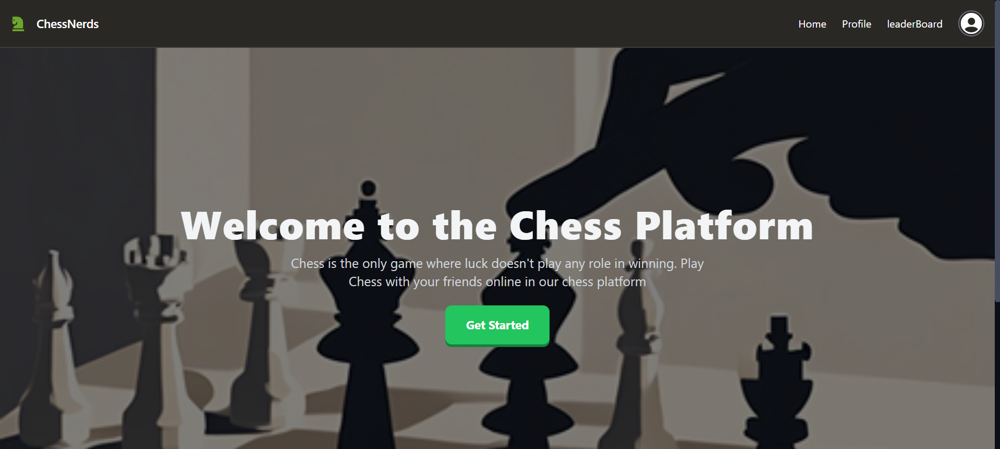

### **2. Authentication Page**

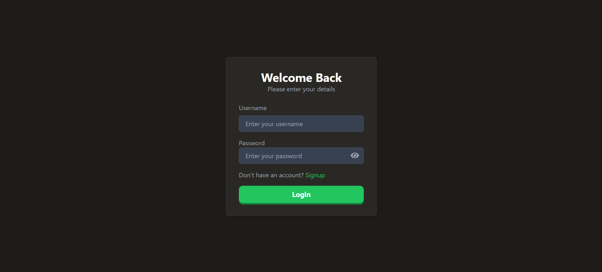

### **3. Game Lobby**

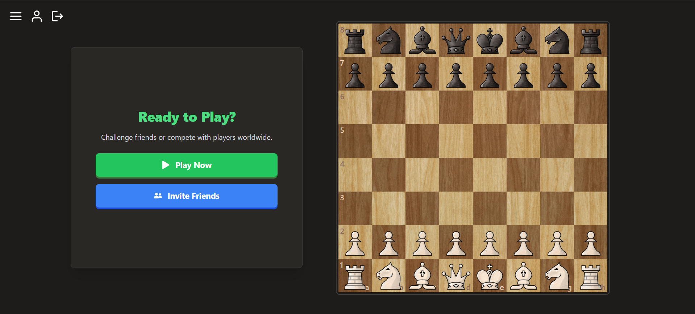

### **4. Invite Friend Page**
Can Send & Accept friend or game request

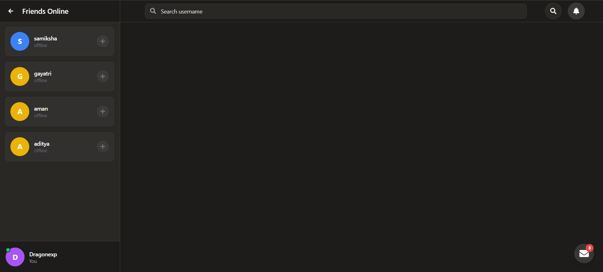

#### Invite Friend page contains functionalities :-

1. **Inbox** : 
Inbox contains all the request from other player, it can be friend request and Game request.

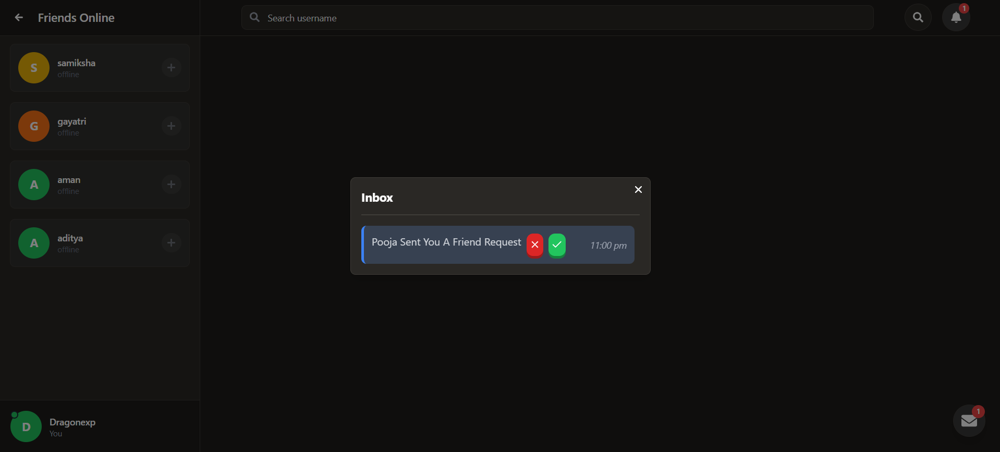
***

2. **Message box** :
Message box contains all the message of actions like accepted a friend request and send a friend request.

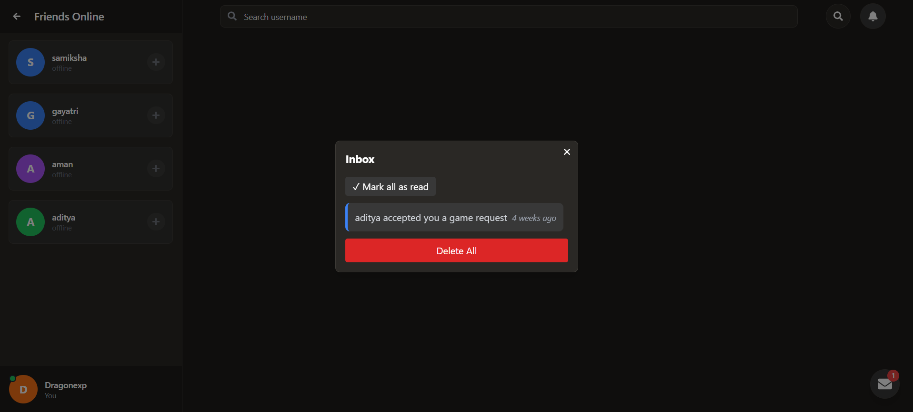
***

3. **Online friends** :
Shows all online friends. If friend is online, then only you can send a game request to your friend.

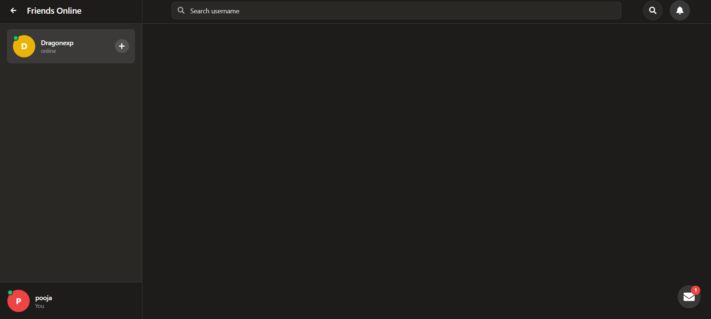
***

4. **Search friends** :
Shows all online friends. If friend is online, then only you can send a game request to your friend.

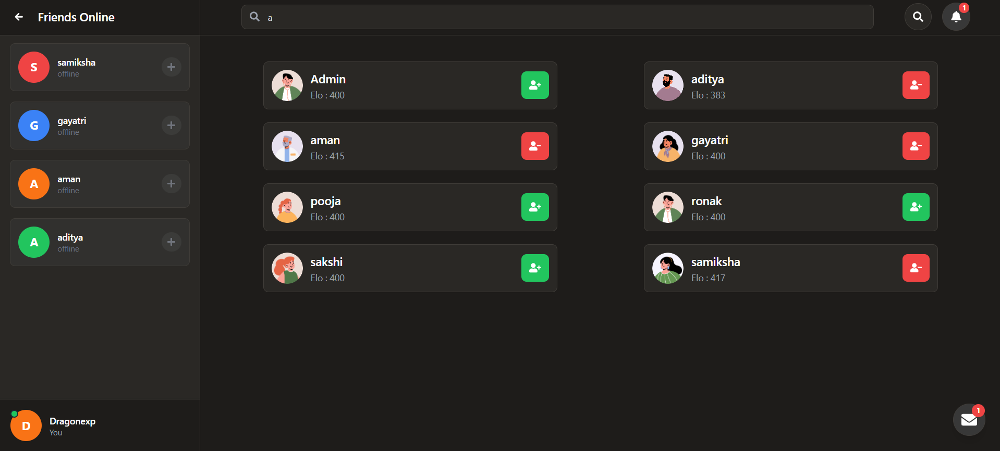

### **5. Game Page**

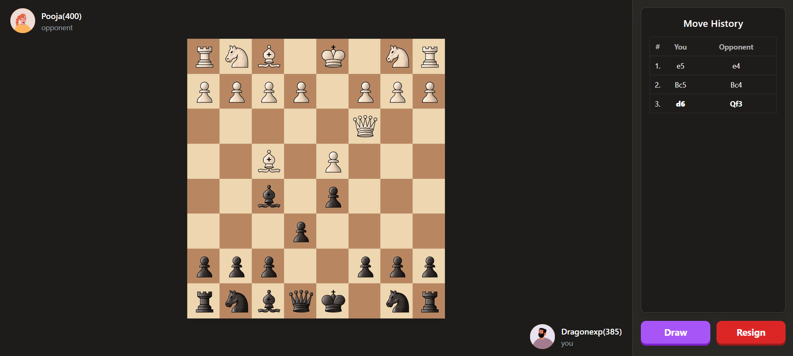

### **6. Result Model**

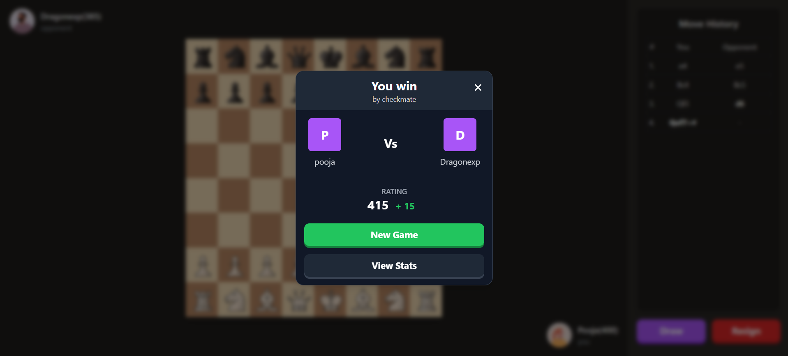

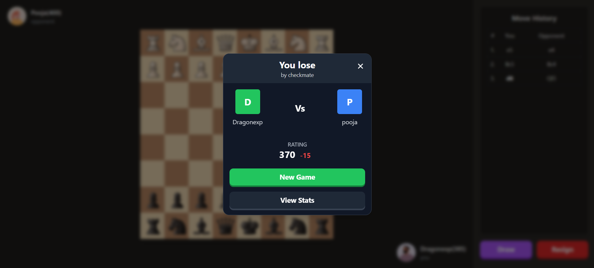

### **7. Leaderboard**
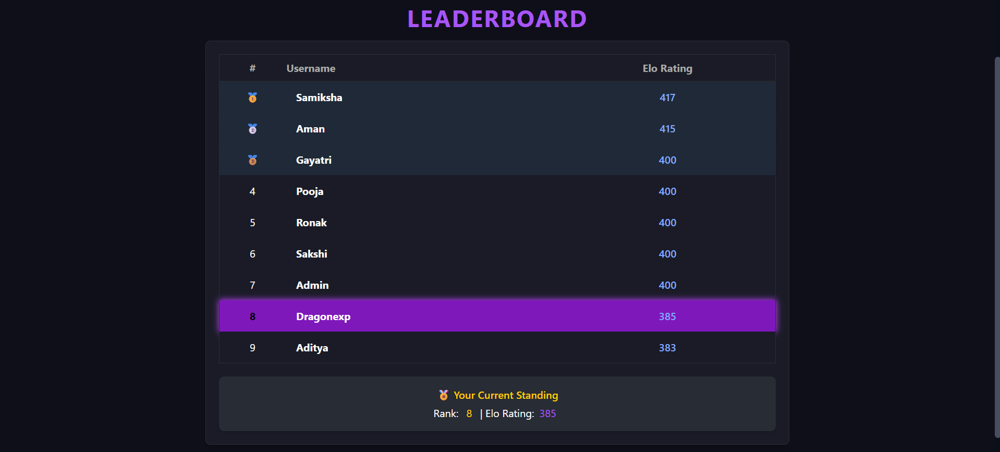

### **8. Profile**
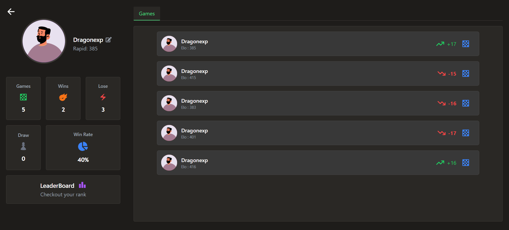

### **9. Random Matchmaking**


<a id="project-start-guide"></a>
## 🚀 Project Start Guide

### Prerequisites

- Node.js and npm installed
- MongoDB running locally or a cloud DB URI (e.g., MongoDB Atlas)

### Clone the repository

```bash
git clone https://github.com/Dev-omkarCh/PlayChess.git
cd play-chess
```
### Backend setup
```bash
cd backend
npm i express mongoose cors jsonwebtoken bcryptjs cookie-parser
npm i nodemon -D
npm run server
```

### Frontend Setup
```bash
cd frontend
npm create vite@latest .
npm i react-router-dom react-icons axios zustand 
npm run dev
```
### Tailwind Css Setup
```bash
npm install tailwindcss @tailwindcss/vite
npx tailwindcss init # if not works, create the file: tailwind.config.js
```

### Environment Variables
Create a .env file inside the server/ directory with the following keys:
```.env
PORT=4000
MONGO_URI=your_mongodb_connection_string
JWT_SECRET=your_jwt_secret
```
<a id="Future-Enhancements"></a>
## 🪛 Future Enhancements

- **Spectator Mode**: Allow users to watch ongoing games.
- **AI Opponent**: Add a single-player mode with AI.
- **Chat System**: Enable in-game chat between players.
- **Game Replay**: Replay completed games move by move.


<a id="author"></a>

## 👨‍💻 Author

- Omkar Chikhale
- omkarchikhale.dev@gmail.com 📧

<a id="socials"></a>

## 🔗 Socials
[](https://www.linkedin.com/in/omkar-chikhale/)  
[](https://twitter.com/your-username)  
[](https://www.instagram.com/om.kar816?igsh=MWd5dDF5bGd5ejFpMw==)  
[](https://www.facebook.com/profile.php?id=100087449895467&amp;mibextid=ZbWKwL)

> 


